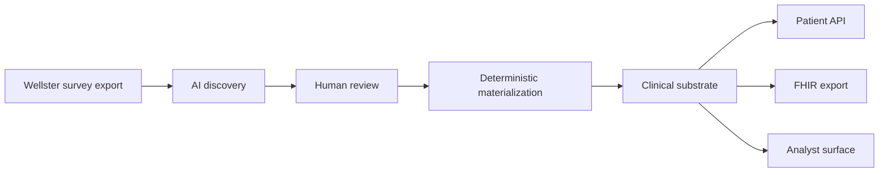
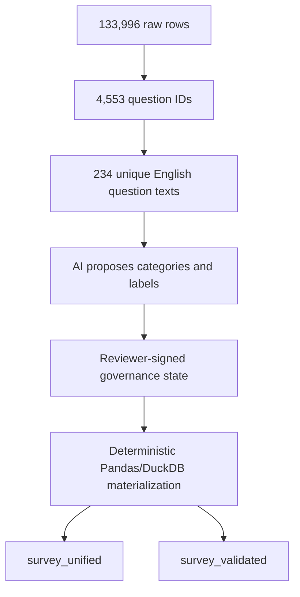
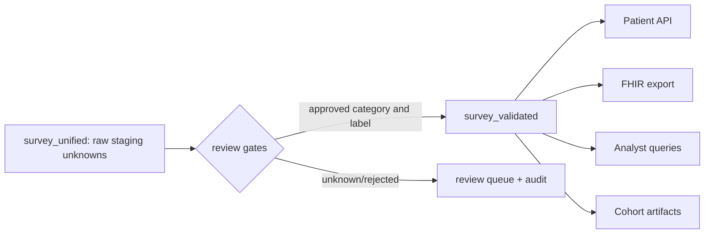
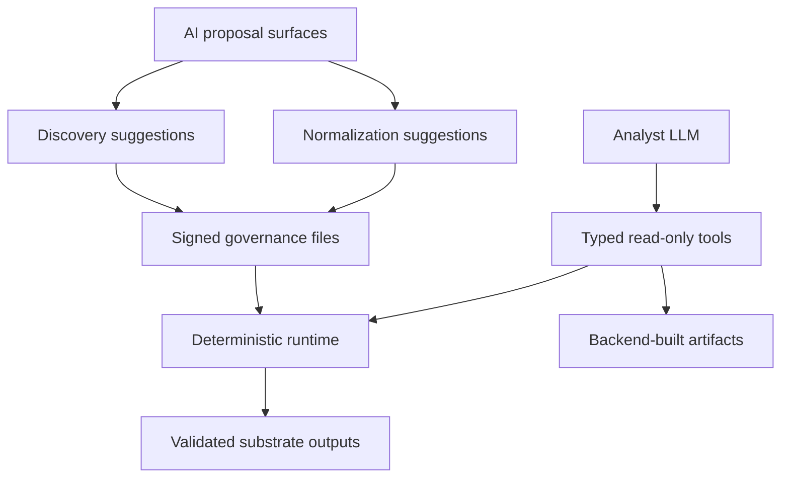

---
tags: [uniq, wellster, technical-deepdive, external]
type: technical-doc
date: 2026-04-29
audience: Wellster Data Team + Product Owners
authored-by: Eren Demir (UniQ)
status: external-draft
---

# UniQ Technical Deep-Dive for Wellster

This document explains how UniQ turns fragmented Wellster survey data into a
reviewed, queryable clinical substrate. It focuses on the engine, the trust
model, answer normalization, reproducibility, and the analyst/API surfaces.

## Executive Summary

UniQ is a Clinical Truth Layer beside your operational systems. It does not
replace Wellster databases; it materializes a reviewed layer that downstream
analytics, FHIR export, and analyst workflows can query consistently.

The core pattern is:

```text
AI proposes structure -> human review signs the meaning -> deterministic code materializes the substrate
```

The important technical point is that AI is used to discover semantic structure,
not to continuously reinterpret every row at runtime. Once mappings and
normalization decisions are signed, materialization is deterministic and
auditable.



## 1. Current Substrate Snapshot

The current Wellster snapshot is materialized and verifiable through:

```text
GET /v1/substrate/manifest
output/materialization_manifest.json
```

**Current snapshot**

- **Raw input rows:** 133,996
- **Raw question IDs:** 4,553
- **Unique English question texts in mapping table:** 234
- **Clinical categories:** 20
- **Patient records:** 5,374
- **Raw/staging survey events:** 133,996
- **Validated survey events:** 116,207
- **Normalization registry records:** 527
- **Open unknown answer variants:** 217
- **Quality findings:** 1,041
- **Chat eval:** 19/19 passed

The manifest includes input hashes, mapping hashes, normalization hashes,
output-table hashes, validation coverage, chat-eval status, git commit, and
patient-retraction stats.

## 2. Example: Why the Substrate Matters

Once the reviewed substrate exists, cross-brand cohort logic becomes repeatable
instead of ad hoc analysis.

On the current substrate, the Spring -> GoLighter screening path computes:

**Current Spring -> GoLighter funnel**

- **Spring patients:** 4,557
- **BMI >= 27:** 2,029
- **No GoLighter history:** 2,014
- **Active in last 180 days:** 451
- **High priority:** 59

This is a deterministic join across validated brand history, current BMI state,
target-brand history, and recent activity. The point is not that UniQ makes a
commercial decision; it makes the clinical cohort logic inspectable and
repeatable.

## 3. Engine Architecture

The engine has three stages.



### Stage 1: Semantic Discovery

UniQ first collapses repeated survey rows into a smaller pattern set:

```text
133,996 rows -> 4,553 question IDs -> 234 unique English question texts
```

AI is used on this pattern layer to propose:

- the clinical category for each question;
- semantic labels and FHIR resource families for categories;
- canonical answer labels for repeated answer variants.

This is the main cost and robustness advantage: AI reasons over the structure of
the dataset, not over every patient row.

### Stage 2: Human Review and Governance

The review layer captures what Wellster accepts as clinically meaningful.

**Current governance state**

- **Semantic categories:** 17 approved, 3 rejected
- **Answer-normalization records:** 527 approved
- **Unknown answer variants:** 217 open for review

Category review controls whether a semantic category is allowed into the
validated clinical layer. Answer-label review controls whether normalized values
are allowed into the validated clinical layer.

Reviewer identity is captured through governance write headers:

```text
X-Uniq-Reviewer
X-Uniq-Role
```

This keeps the review state attributable without forcing a full SSO integration
into the first technical pilot.

### Stage 3: Deterministic Materialization

After review, Pandas/DuckDB code applies the signed mappings across the full
dataset. The key outputs are:

**Runtime surfaces**

- **`survey_unified`**
  Raw/staging layer for audit, debugging, unknowns, rejected/nonclinical categories.

- **`survey_validated`**
  Downstream clinical layer: approved categories and approved normalized values.

- **`patients`**
  Typed patient index.

- **`bmi_timeline`**
  Longitudinal BMI events.

- **`medication_history`**
  Medication and dosage events.

- **`quality_report`**
  Data-quality findings.

- **`clinical_annotations`**
  Clinician write-back notes.

The central boundary is `survey_unified` vs `survey_validated`.

`survey_unified` preserves what came in and what the pipeline inferred.
`survey_validated` is what clinical downstream consumers should use by default.
Unknown or rejected values stay inspectable, but they do not become signed
clinical facts.



## 4. Answer Normalization Trust

This is the most important distinction from simple category classification.
Classifying a question as "current medication" is not enough; the answer values
also need to be normalized and governed.

UniQ stores answer normalization as reviewable records:

```json
{
  "id": "norm-...",
  "category": "CURRENT_MEDICATIONS",
  "original_value": "L-thyroxin",
  "canonical_label": "LEVOTHYROXINE",
  "review_status": "approved",
  "source_count": 12,
  "first_seen": "2026-...",
  "last_seen": "2026-..."
}
```

Current implementation:

- every `(category, original_value)` has a stable record;
- review state exists per label, not only per category;
- source count and first/last seen timestamps are tracked;
- casing collisions are surfaced instead of overwritten;
- unknown new variants go into a review queue.

Relevant API surfaces:

```text
GET   /v1/normalization
GET   /v1/normalization/unknown
PATCH /v1/normalization/{id}
POST  /v1/normalization/unknown/{id}/resolve
```

**Current unknown queue**

- **Total entries seen:** 338
- **Open:** 217
- **Promoted into registry:** 121
- **Dismissed:** 0

This means unknown answer variants are not silently trusted. They remain visible
for review while the validated layer stays limited to reviewed semantics.

## 5. AI Drift and Runtime Guardrails

There are three AI surfaces, each bounded differently.

**AI surfaces**

- **Discovery AI**
  Runs on unique question/answer patterns; output is reviewed and persisted.

- **Answer normalization AI**
  Produces candidate labels; registry review state decides runtime trust.

- **Analyst LLM**
  Read-only tools, typed tool schemas, backend-resolved artifacts.



The substrate itself is deterministic after mappings and normalization records
are written. A later run can be compared through manifest hashes.

The analyst chat does use an LLM at query time, but it is not allowed to mutate
the substrate or invent arbitrary artifacts. It is constrained by:

- read-only SQL guardrails in `query_service.py`;
- blocked file/network table functions, DDL/DML, stacked statements, `ATTACH`,
  `COPY`, and `PRAGMA`;
- Pydantic-validated tool inputs;
- terminal artifact tools such as `present_table`, `present_fhir_bundle`, and
  `present_opportunity_list`;
- backend handle resolution for SQL results.

Test coverage for this layer:

```text
query guardrail tests: 7/7
chat agent tests:      5/5
chat eval:             19/19
```

## 6. Reproducibility and Audit Trail

Every materialization run writes a manifest:

```text
output/materialization_manifest.json
```

The API exposes the same summary:

```text
GET /v1/substrate/manifest
```

The manifest includes:

- input row count and input hash;
- semantic mapping hash and review-state counts;
- normalization registry hash and queue counts;
- output-table row counts and hashes;
- `survey_validated` coverage;
- chat-eval result and stale flag;
- active retraction count;
- git commit.

This gives Wellster a concrete way to verify what changed between runs. The
manifest is the receipt for the substrate state.

Clinician write-back is supported through `clinical_annotations`. Notes can be
pinned to patient-level or event-level context and carry reviewer identity. This
turns the substrate from a one-time export into operational memory: reviewed
context can be added back to the patient record without editing upstream source
systems.

## 7. Healthcare Data Governance

The current pilot surface is designed around the practical controls a German
healthcare data team will ask for first: traceability, reviewer attribution,
right-to-erasure handling, and a clear separation between raw source data and
reviewed clinical substrate.

Relevant governance context:

- **DSGVO Art. 17:** patient retraction path for right-to-erasure requests.
- **ePA / EHDS / GDNG context:** UniQ does not claim formal certification here;
  the architecture is built to make provenance, auditability, and data reuse
  boundaries inspectable.
- **Hosting assumption for pilot:** dedicated EU environment, encrypted storage,
  restricted admin access, and final hosting model agreed during pilot setup.

## 8. Patient Retraction

Patient retraction is implemented at the materialized-output layer.

Operational command:

```powershell
python scripts/purge_patient.py --user-id 12345 --deleted-by "privacy@wellster" --reason "DSGVO erasure request"
```

The retraction flow:

- removes patient rows from materialized CSV/JSON outputs;
- removes clinical annotations for that patient;
- writes a tombstone so future pipeline runs do not re-expose the patient;
- makes `/patients/{id}` return 404;
- makes `/export/{id}/fhir` and `/v1/export/{id}/fhir` return 404;
- re-applies active tombstones during later materialization runs.

Tombstones store a server-secret HMAC-SHA256 of `user_id`, not the plain patient
ID. This is pseudonymization, not anonymization, and the secret must be managed
outside git.

## 9. FHIR Export

FHIR export is available per patient:

```text
GET /export/{id}/fhir
GET /v1/export/{id}/fhir
```

Worked example:

```text
GET /v1/export/383871/fhir
```

returns:

```text
23 FHIR resources
1 Patient
11 Observations
11 MedicationStatements
```

The export path runs an internal smoke validator before returning the bundle.
This is not a formal HL7 certification claim; it is a structural check for the
pilot export surface.

FHIR construction uses typed tables plus the validated survey layer. Category
trust comes from `semantic_mapping.json`; value coding currently uses the
existing obesity-domain code tables in `medical_codes.py`.

## 10. Quality Monitoring

`quality_report.csv` is materialized on each run. Current checks include:

- BMI spike greater than 5 points between measurements;
- BMI measurement gap greater than 90 days;
- undocumented medication switch;
- subscription lapse;
- suspicious BMI value.

Current output:

```text
quality_report rows: 1,041
```

**Example findings**

- **warning / `bmi_spike`**
  BMI changed by 5.8 points between measurements.

- **warning / `bmi_gap`**
  Patient has 370 day tenure but no BMI recorded.

- **info / `undocumented_switch`**
  Medication switch: Mounjaro -> Wegovy.

These are data-quality findings, not automated clinical warnings.

## 11. Analyst Surface as Consumer Example

The analyst surface demonstrates what downstream consumers can do once the
validated substrate exists. It is not the source of clinical truth; it is a
controlled query-and-artifact layer on top.

Live artifact families:

- cohort trend;
- alerts table;
- generic table;
- FHIR bundle;
- patient record;
- opportunity list.

The cross-brand opportunity funnel from section 2 is one example of this layer:
the analyst requests the artifact, but the cohort is computed by deterministic
backend logic against the validated substrate.

## 12. Pilot Operating Model

The first Wellster pilot should be a joint technical validation, not a black-box
deployment.

Recommended working session:

1. Walk through `/v1/substrate/manifest`.
2. Inspect `survey_unified` vs `survey_validated`.
3. Review approved and rejected categories.
4. Review normalization records and open unknown variants.
5. Pick 5-10 known patients and compare UniQ output against Wellster source
   truth.
6. Validate FHIR output for those patients.
7. Simulate one retraction on a disposable output copy.
8. Agree quality-threshold tolerances.

The goal is to turn the current substrate into a Wellster-signed substrate:
same architecture, but with Wellster-reviewed mappings, labels, and thresholds.

**Recommended next step**

Schedule a 60-minute technical walkthrough. We bring the manifest live, validate
5-10 patients against Wellster source truth, inspect the normalization queue,
and align the pilot scope around the review depth Wellster wants.

## 13. Expansion Path

The current implementation is focused on Wellster survey CSV/TSV data. The
governance pattern is reusable across modalities, but each new modality still
requires a loader, entity mapping, review surface, deterministic unification
logic, and tests.

The practical first expansion questions for Wellster are therefore data-source
questions: which additional source should join the substrate next, and what
review surface does that source require? Notes, PDFs, images, and wearables all
fit the same governance pattern, but none should be treated as a config-only
loader.

For the first technical pilot, the narrower goal is enough: prove that
Wellster's fragmented survey data can be converted into a reviewed, auditable,
queryable clinical substrate.

## Appendix: Verification Commands

From `wellster-pipeline/`:

```powershell
python pipeline.py
python tests/test_normalization_registry.py
python tests/test_retractions.py
python tests/test_query_guardrails.py
python tests/test_query_service.py
python tests/test_api.py
python tests/test_chat_agent_v2.py
python tests/test_semantic_mapping.py
python tests/run_chat_eval.py
```

Key API checks:

```text
GET /v1/substrate/manifest
GET /v1/normalization
GET /v1/normalization/unknown
GET /patients/383871
GET /v1/export/383871/fhir
```
